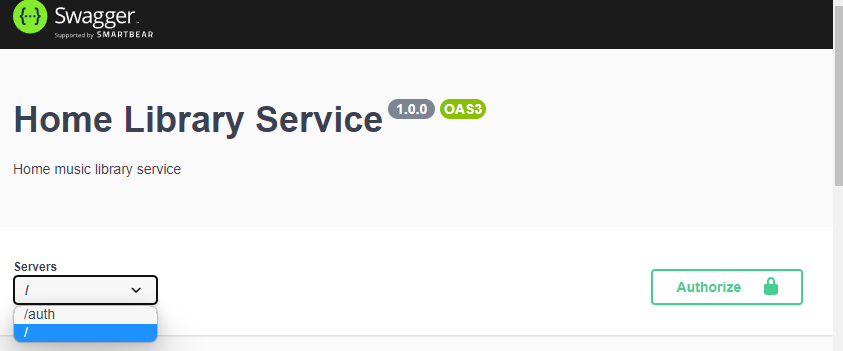
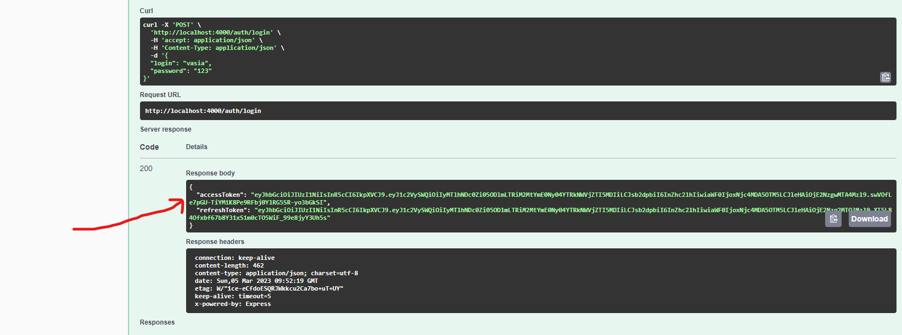
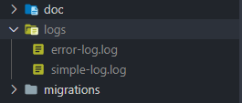

# Project: Music Service

## Description

Created a Home Library Service! `Users` can create, read, update, delete data about `Artists`, `Tracks` and `Albums`, add them to `Favorites` in their own Home Library!

## Downloading

⚠️ The project uses docker images, you must have a docker application in your local machine

```
git clone git@github.com:conservativ007/nodejs2022Q4-service.git
```

```
cd nodejs2022Q4-service
```

## Installing NPM modules

```
npm install
```

## Run application without docker

You need to run the postgres DB, see the .env file for settings for postgres

Also you need to change the `host: configService.get('POSTGRES_HOST')` to `host: 'localhost'` in the file
nodejs2022Q4-service\src\common\typeOrm.config.ts

```
npm run typeorm:run-migrations
```

```
npm run start:dev
```

## Run application in Docker container

```
npm run docker:build
```

After starting the app on port (4000 as default) you can open in your browser OpenAPI documentation by typing http://localhost:4000/api/.




⚠️ Don't forget to chose the /auth for the following routes (signup, login, refresh). All other routes in this app is using the next route ( / ). Also don't forget will pass the Bearer token in authorize before use this app for the all routes (/user, /artist, /favorites...)

For easy verification, the Insomnia json file is at the root of the project.

#### Logging

Logs are written to logs folder



## Testing

After application running you can use tests:

```
npm run test:auth
```

To run only one of all test suites

```
npm run test -- <path to suite>
```
